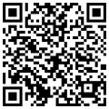

<p align="center">
  [](https://travis-ci.org/pascalmartin/bip39split)
</p>

# bip39split
Tool to create fragmented paper backup of your bip39 mnemonic phrase.<br />
This tool uses [secret sharing](https://en.wikipedia.org/wiki/Shamir's_Secret_Sharing)
for distributing your mnemonic phrase into cryptographically-secure pieces.<br />
Then you save the pieces in different places and to reconstruct the original, combine a specific number of pieces.

# Online Version
Not recommended for safety reasons, be careful<br />
[bit39split.com](https://pascalmartin.github.io/bip39split)

# Standalone offline version
Recommended use<br />
*Never use bip39split tool on a computer connected to internet*
* Create a bootable ubuntu usb stick
* Copy bip39split.html on another usb key
* Boot Live ubuntu and run bip39split.html

# Build local
```bat
npm install  
npm run compileBip39Lib  
npm run dist
```

# Credits

Inspired by

* Some features of [Bitcoin Armory](https://btcarmory.com) - [github](https://github.com/goatpig/BitcoinArmory)
    * [Fragmented Backups](https://www.bitcoinarmory.com/tutorials/armory-advanced-features/fragmented-backups/)
    * [Secure Print](https://www.bitcoinarmory.com/tutorials/armory-basics/secure-print/)
* [passguardian.com](http://passguardian.com) - [github](https://github.com/amper5and/secrets.js)

Powered by

* [bip39](https://github.com/iancoleman/bip39) for Mnemonic validation and conversion
* [secrets.js](https://github.com/grempe/secrets.js)  for split and restore
* [qrcodegen.js](https://www.nayuki.io/page/qr-code-generator-library#javascript) for QR code generator
* [instascan](https://github.com/schmich/instascan) for QR code reader
* [mustache](https://github.com/janl/mustache.js) for templating
* [spectre.css](https://picturepan2.github.io/spectre/) for styling
* [sjcl](https://github.com/bitwiseshiftleft/sjcl)

# Donations
If you find this project useful, please make a small donation to keep this project healthy.<br />

| Coin  | Address   | QR Code |
| ----- | --------- | ------- |
| Bitcoin BTC | 33bWirMx4k2VXTxreLJFdWXgJE7buxMfAR |  |
| Ethereum ETH | 0x408c70e0C125894854700B23Cc8E5a9e7a3908ae |  |
| XRP | rDaEQkutXT7oXGnnqdnsKbZXN5zpHBwUA9 |  |

---

Cross-browser testing provided by:

<a href="http://browserstack.com"></a>